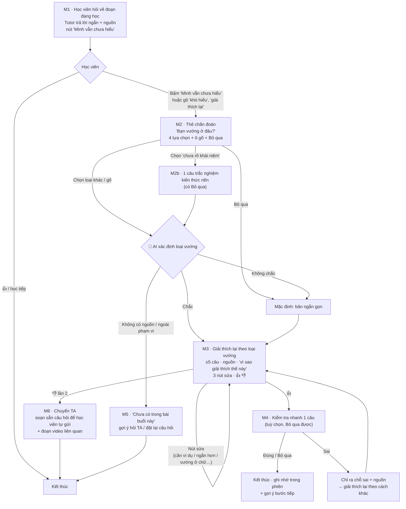

# P3 · Workflow v2 — góp ý bản mock "Adaptive AI Tutor" và đề xuất phát triển

> Pain giữ nguyên (P3): **học viên đã đọc giải thích của tutor mà vẫn chưa hiểu, tutor không biết họ vướng ở đâu nên giảng lại cùng một kiểu → hỏi đi hỏi lại, mất thời gian hoặc bỏ cuộc.**
> Bằng chứng: 106 lượt / 49 học viên K4 nói chưa hiểu hoặc xin giải thích lại; tutor vẫn dùng `review_concept` 86/106 lần, chỉ 1 lần hỏi lại để tìm chỗ vướng; trung vị câu trả lời 995 ký tự (T10317, T10536, T10728, T10807, T10480).
> Mức tự động: **Conditional** (xem `P3-muc-tu-dong-hoa.md`).

---

## 1. Bản mock hiện tại: giữ gì, sửa gì

### Nên giữ

| Điểm trong mock | Vì sao tốt |
|---|---|
| Hỏi 1 câu trước khi giải thích lại (bước 2) | Đúng tinh thần P3: tìm chỗ vướng trước khi giảng |
| Kiểm tra lại bằng câu hỏi thay vì hỏi "Bạn hiểu chưa?" (bước 4) | Có tín hiệu hành vi thật, dùng được cho đo lường |
| Đổi cách giải thích khi vẫn chưa hiểu (bước 6) | Đúng vấn đề của tutor hiện tại (lặp `review_concept`) |
| Dòng "Trợ giảng AI có thể sai — hãy đối chiếu với bài giảng" | HAX G2 — nói rõ AI làm tốt đến đâu |
| Nút gợi ý bước tiếp ("Xem ví dụ code / Giải thích sâu hơn / Làm bài luyện tập") | Cho học viên quyền chọn hướng |

### Cần sửa

| # | Vấn đề | Vì sao là vấn đề | Đề xuất |
|---|---|---|---|
| **1** | **Điểm kích hoạt sai pain.** Mock hỏi chẩn đoán ngay với câu hỏi *đầu tiên* ("ReAct là gì?") | P3 là pain *sau khi đã đọc giải thích mà vẫn chưa hiểu*. Hỏi chẩn đoán cho mọi câu hỏi làm chậm cả những người không cần | Lần hỏi đầu: tutor trả lời bình thường, ngắn, có nguồn. Tính năng P3 bật khi học viên **bấm "Mình vẫn chưa hiểu"** hoặc gõ lại kiểu "khó hiểu / giải thích lại" |
| **2** | **Câu chẩn đoán chỉ đo kiến thức nền.** Câu trắc nghiệm A–D chỉ phát hiện loại "thiếu nền" | Data cho thấy học viên vướng vì nhiều lý do: cần ví dụ (T10480), quá dài (T10508), không rõ (T10536) | Câu chẩn đoán hỏi **"Bạn vướng ở đâu?"** với 4 lựa chọn theo loại vướng + ô gõ. Câu trắc nghiệm kiến thức nền chỉ xuất hiện khi học viên chọn "chưa rõ khái niệm" |
| **3** | **Nhãn "Hiểu tốt / Hiểu sơ / Chưa hiểu" và learner state lâu dài** | Một câu trắc nghiệm không đủ để kết luận năng lực. Mâu thuẫn với quyết định "AI không kết luận năng lực học viên". Thêm một quyết định AI thứ hai, lát cắt không còn là một câu | Thay bằng **ghi nhớ trong phiên**: "Trong phiên này bạn đã hỏi lại về: Observation". Chỉ mô tả hành vi, không dán nhãn; học viên xoá được |
| **4** | **Knowledge Graph + Policy + RAG + Learner State** ở phần kiến trúc | Quá rộng cho 39 giờ; TA sẽ hỏi "quyết định AI trung tâm là gì?" | Giữ 1 quyết định AI: **xác định loại vướng**. Chiến lược giải thích là **bảng tra cố định** theo loại vướng (không cần AI). Knowledge Graph và hồ sơ học tập → backlog |
| **5** | **Lời giải thích không có nguồn** (bước 3, 6) | Vi phạm Conditional: không có nguồn thì không được giải thích; mất G11 | Mỗi lời giải thích có dòng *"Dựa trên: Transcript Day 1, đoạn [T04-0xx]"* |
| **6** | **Thiếu nút Bỏ qua và nút sửa** | Mất G8, G9 (G8/G9/G11 phải có ít nhất 1) | Thêm **Bỏ qua** ở thẻ chẩn đoán; thêm 3 nút sửa dưới lời giải thích |
| **7** | **Thiếu đường lỗi:** không có nguồn, ngoài phạm vi, chưa hiểu mãi | §6 bắt buộc có đường failure; bước 6 có thể lặp vô hạn | Thêm màn hình "chưa có trong bài" và "chuyển TA"; giới hạn 2 lần 👎 |
| **8** | **Chủ đề ReAct không có nguồn trong data pack.** Transcript-04/06 nói về transformer, attention, agent nói chung; không có đoạn nào nhắc "ReAct" | Không có nguồn thì không trích dẫn được → demo happy path sẽ phải bịa hoặc hardcode | **Phương án A (khuyên dùng):** đổi chủ đề demo sang **attention** (transcript-04/06 có 28 lần nhắc; câu hỏi thật T10728). **Phương án B:** giữ ReAct (bằng chứng mạnh: 344 lượt / 85 học viên ở phần ReAct) nhưng nhóm tự viết một tài liệu nguồn ngắn, ghi rõ là fixture tự soạn |
| **9** | Chip gợi ý "Hãy giải thích về prompt engineering" trong khung chat | Không liên quan bài đang học, gây nhiễu | Chip theo ngữ cảnh: "Giải thích đoạn đang bôi đen" |

---

## 2. Workflow v2

### 2.1 Luồng người dùng



### 2.2 Màn hình cho mock

| Màn | Nội dung | Nguyên tắc HAX/PAIR |
|---|---|---|
| **M1** · Trang học + trả lời lần 1 | Slide/video, đoạn bôi đen, trả lời ngắn có nguồn, nút **"Mình vẫn chưa hiểu"** kèm tooltip phạm vi | G1, G2 |
| **M2** · Thẻ chẩn đoán | "Bạn vướng ở đâu?" → ① Chưa rõ một khái niệm ② Cần ví dụ ③ Đọc dài/rối quá ④ Mình hiểu khác → ô gõ "Mình vướng ở chữ…" → **Bỏ qua** | G10, G8 |
| **M2b** · Câu kiến thức nền | 1 câu trắc nghiệm về khái niệm nền (chỉ khi chọn ①), có Bỏ qua | G10 |
| **M3** · Giải thích lại | ≤5 câu theo loại vướng; dòng *"Mình giải thích bằng ví dụ vì bạn chọn 'cần ví dụ' · Dựa trên [T04-0xx]"*; nút sửa **Cần ví dụ / Ngắn hơn / Sâu hơn**; 👍 👎 | G11, G9, G15 |
| **M4** · Kiểm tra nhanh | 1 câu áp dụng (tuỳ chọn); đúng → khen ngắn + "Trong phiên này bạn đã nắm: …"; sai → chỉ ra chỗ sai + nguồn | G10, PAIR Feedback + Control |
| **M5** · Không có căn cứ / ngoài phạm vi | "Phần này chưa có trong bài buổi này, mình không muốn đoán." + nút *Hỏi TA* / *Đặt lại câu hỏi* | G10, PAIR Errors + Graceful Failure |
| **M6** · Chuyển TA | Sau 2 lần 👎: câu hỏi soạn sẵn (không tên học viên) để **học viên tự gửi** lên Discord + đoạn video gần nhất | G10, G17 |

### 2.3 Bảng chiến lược theo loại vướng (tra cứu cố định, không cần AI)

| Loại vướng (`gap_type`) | Cách giải thích lại | Câu kiểm tra ở M4 |
|---|---|---|
| `thieu_nen` — chưa rõ khái niệm | 1–2 câu giải thích khái niệm nền → quay lại đoạn gốc | Hỏi về khái niệm nền |
| `can_vi_du` — cần ví dụ | 1 ví dụ đời thường, ánh xạ từng phần | Cho tình huống mới, hỏi phần nào ứng với khái niệm |
| `qua_dai` — dài/rối | ≤3 câu, chia bước đánh số | Sắp xếp thứ tự các bước |
| `hieu_sai` — hiểu khác | Chỉ đúng chỗ sai, trích đoạn nguồn | Câu đúng/sai về chỗ vừa sửa |
| `khong_ro` — không xác định được | Dùng `qua_dai` làm mặc định | Tuỳ chọn |

Khi học viên bấm 👎 lần 1, hệ thống **đổi sang chiến lược kế tiếp** trong bảng (ví dụ `thieu_nen` → `can_vi_du`), không lặp lại cùng kiểu.

---

## 3. Quyết định AI trung tâm (duy nhất)

**Lời gọi AI 1 · Xác định loại vướng.** Input: đoạn bôi đen + câu hỏi gốc + trả lời lần 1 + lựa chọn/ô gõ ở M2 (+ kết quả M2b nếu có).

```json
{
  "gap_type": "thieu_nen | can_vi_du | qua_dai | hieu_sai | khong_ro",
  "missing_concept": "vector / trọng số",
  "confidence": 0.0,
  "source_ids": ["T04-0xx"],
  "in_scope": true
}
```

**Lời gọi AI 2 · Giải thích lại** theo `gap_type` và bảng chiến lược, chỉ dùng `source_ids` đã tìm được.

**Kiểm tra output bằng code:** ≤5 câu · `source_ids` có trong kết quả tìm kiếm · không trùng lời giải thích lần 1 · không chứa câu kết luận năng lực.

> Lát cắt một câu: *Một học viên vừa đọc giải thích của tutor về một đoạn bài giảng mà vẫn chưa hiểu · cần hiểu đoạn đó · **AI xác định học viên vướng ở đâu** · học viên nhận lời giải thích lại nhắm đúng chỗ vướng, ≤5 câu, kèm đoạn nguồn.*

---

## 4. Sáu đường đi (spec §6)

| Đường | Tình huống demo | Màn |
|---|---|---|
| **Happy path** | T10728-like: "bước 2 là gì, tại sao lại cộng trọng số" → chọn ① → M2b đúng → giải thích khái niệm nền → 👍 → M4 đúng | M1 → M2 → M2b → M3 → M4 |
| **Low-confidence ②** | T10536-like: "Đang không hiểu gì chớt" → AI không chắc → bản ngắn gọn + báo "mình thử cách ngắn gọn trước" | M2 → M3 |
| **Failure ①** | Hỏi nội dung không có trong transcript (vd một thuật ngữ chưa dạy) | M5 |
| **Correction** | AI giải thích theo `thieu_nen`, học viên bấm "Cần ví dụ" → giải thích lại ngay bằng ví dụ | M3 → M3 |
| **Ngoài phạm vi ③** | T10709-like: "viết một blog bài giảng chi tiết…" hoặc "bỏ qua hướng dẫn trước" | M5 |
| **Đặc thù domain ④** | Giải thích đơn giản quá mức đến sai ("attention là chỉ nhìn một từ quan trọng nhất") → bị bước kiểm tra output / golden set bắt | M3 (validator) |
| **Chưa hiểu mãi** | 👎 hai lần | M6 |

---

## 5. Hướng phát triển thêm (vẫn trong P3)

| Ý tưởng | Giá trị | Làm trong hackathon? |
|---|---|---|
| **Tự phát hiện tín hiệu hỏi lại:** khi học viên gõ "khó hiểu / giải thích lại / chưa hiểu" hoặc hỏi lại cùng đoạn trong 3 phút → tự hiện thẻ M2 | Dựa đúng bằng chứng (45 lượt hỏi lại trong 3 phút) | **Có** — rule đơn giản |
| **Nút mức độ "Ngắn hơn / Sâu hơn"** | Data: câu mẫu "sâu và chi tiết hơn" 55 lần, "thật đơn giản" 23+ lần | **Có** — là nút sửa ở M3 |
| **Đổi chiến lược theo bảng khi 👎** | Giải quyết đúng việc tutor lặp `review_concept` | **Có** |
| **Ghi nhớ trong phiên** (không dán nhãn năng lực) | Không hỏi lại điều học viên đã chọn | **Có**, mức nhẹ |
| **Câu hỏi soạn sẵn cho TA** ở M6 | Học viên không phải kể lại từ đầu | Mock (không gửi thật) |
| Hồ sơ hiểu biết lâu dài, Knowledge Graph | Cá nhân hoá sâu | **Backlog** |
| Tổng hợp `gap_type` ẩn danh cho giảng viên (nối sang P6) | Giảng viên biết lớp vướng kiểu gì | **Backlog** |

---

## 6. Kế hoạch build mock (sau khi thống nhất)

- **Hình thức:** trang tĩnh HTML/CSS/JS, 6 màn hình (M1–M6), bấm qua lại được; nội dung giả lập theo 6 đường ở mục 4.
- **Chủ đề demo:** theo quyết định ở mục 1 dòng 8 (attention hoặc ReAct có tài liệu tự soạn).
- **Chưa gọi AI thật** ở CP2; CP3 thay phần giả lập bằng 2 lời gọi AI + validator.
- **Commit** vào repo `K4-3B-E403-THE-LIEMS` kèm sơ đồ luồng ở mục 2.1.

### Cần nhóm chốt trước khi build

1. Điểm kích hoạt: bật P3 **sau** lần trả lời đầu (khuyên dùng) hay giữ chẩn đoán ngay từ đầu như mock cũ?
2. Chủ đề demo: **attention** (có nguồn sẵn) hay **ReAct** (bằng chứng mạnh hơn, phải tự soạn nguồn)?
3. Bỏ nhãn "Hiểu tốt / Hiểu sơ / Chưa hiểu" và thay bằng ghi nhớ trong phiên?
4. Giữ giao diện VLearn (sidebar, video, khung chat bên phải) như mock cũ?
