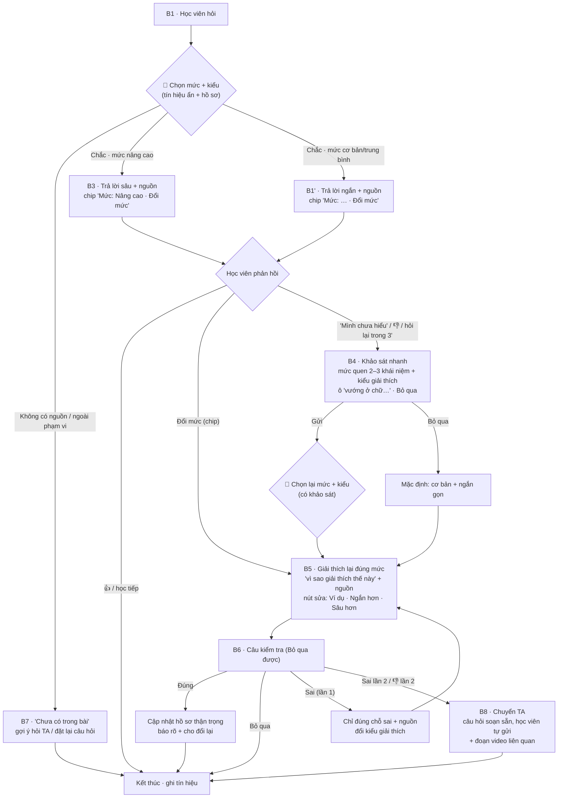

# P3 · Workflow v3 — góp ý bản "đánh giá mức hiểu ẩn + khảo sát khi cần"

> **Pain giữ nguyên (P3):** học viên đã đọc giải thích của tutor mà vẫn chưa hiểu; tutor không biết họ vướng ở đâu nên giảng lại cùng một kiểu → hỏi đi hỏi lại, mất thời gian hoặc bỏ cuộc.
> **Bằng chứng:** 106 lượt / 49 học viên K4 nói chưa hiểu hoặc xin giải thích lại; tutor vẫn dùng `review_concept` 86/106 lần, chỉ 1 lần hỏi lại để tìm chỗ vướng; trung vị câu trả lời 995 ký tự (T10317, T10536, T10728, T10807, T10480).
> **Mức tự động:** Conditional (xem `P3-muc-tu-dong-hoa.md`). Bản này nối tiếp `P3-workflow-v2.md`.

---

## 1. Đánh giá nhanh bản mới

### Đã tốt hơn v2 / mock cũ

| Điểm | Vì sao tốt |
|---|---|
| **Trả lời trước, chỉ hỏi khi cần** (nguyên tắc cuối ảnh) | Sửa đúng lỗi "hỏi chẩn đoán cho mọi câu"; không làm phiền người đã hiểu (HAX G10) |
| **Bước 4 bật khi học viên nói "Mình chưa hiểu lắm"** | Đúng thời điểm của pain P3 |
| **Có nguồn dưới câu trả lời** (Slide tr.12–14, Video 05:20–08:10) | Có căn cứ, học viên tự kiểm được (G11, PAIR Explainability) |
| **Khảo sát dạng lưới Chưa / Biết sơ / Hiểu rõ** | 1 click mỗi dòng, nhanh hơn câu trắc nghiệm |
| **Kiểm tra lại sau giải thích** (bước 6) | Có tín hiệu hành vi để đo, không chỉ hỏi "hiểu chưa?" |
| **Tự lưu lịch sử** để lần sau giải thích đúng mức | Giải quyết gốc của P3: tutor "không biết học viên đang ở đâu" |

### Còn thiếu / cần phát triển

| # | Vấn đề | Vì sao quan trọng với P3 | Đề xuất (chi tiết ở mục 2–6) |
|---|---|---|---|
| **1** | **Có 2 chỗ AI đoán mức hiểu** (bước 2 ẩn, bước 4 sau khảo sát) | Lát cắt chỉ được 1 quyết định AI; TA sẽ hỏi "quyết định trung tâm là gì?" | Gộp thành **một quyết định: chọn mức và kiểu giải thích**, đầu vào là tín hiệu ẩn + khảo sát (nếu có) |
| **2** | **Đoán ẩn mà học viên không thấy, không sửa được** | Đoán sai mức chính là nguyên nhân gây P3 (giải thích quá sâu / quá sơ) | Hiện chip **"Đang giải thích ở mức: Cơ bản · Đổi mức"** dưới mỗi câu trả lời |
| **3** | **Khảo sát chỉ hỏi mức quen khái niệm nền** | Data cho thấy học viên còn vướng vì cần ví dụ (T10480), quá dài (T10508), hiểu khác | Thêm 1 dòng **"Bạn muốn giải thích theo kiểu: Ví dụ · Ngắn gọn · Chi tiết"** + ô "Mình vướng ở chữ…" |
| **4** | **Khảo sát không có nút Bỏ qua** | Chặn luồng; mất G8 | Thêm **"Bỏ qua, giải thích luôn"** cạnh nút Gửi |
| **5** | **Hồ sơ tự lưu nhưng học viên không xem / sửa / xoá được** | Mất quyền kiểm soát (G17); dữ liệu học viên nhạy cảm (an toàn track A) | Thêm màn **"Hồ sơ học của bạn"**: xem, sửa mức, xoá, tắt ghi nhớ |
| **6** | **"Chính xác! → lần sau giải thích ở mức nâng cao hơn"** | 1 câu đúng chưa đủ để nâng mức; nâng sai lại tạo đúng pain P3 lần sau | Quy tắc cập nhật thận trọng (G13/G14): cần ≥2 tín hiệu, chỉ nâng 1 bậc, báo rõ và cho đổi lại |
| **7** | **Thiếu nhánh trả lời sai ở bước 6** | Đường quan trọng nhất của P3 (vẫn chưa hiểu) | Sai → chỉ đúng chỗ sai + nguồn → đổi kiểu giải thích → 👎 lần 2 → chuyển TA |
| **8** | **Thiếu đường không có nguồn / ngoài phạm vi / injection** | §6 bắt buộc; lớp chỗ khó ①③ | Thêm màn "Chưa có trong bài" (giữ từ v2 M5) |
| **9** | **Bước 3 (người giỏi) trả lời thẳng nội dung sâu** | Nếu đoán nhầm là giỏi → người mới nhận câu trả lời khó → đúng pain P3 | Vẫn hiện chip đổi mức + nút "Giải thích đơn giản hơn"; bước 3 là nhánh phụ, **không phải trọng tâm demo** |
| **10** | **Tín hiệu "đã làm quiz/lab chưa", "hồ sơ học tập" không có trong data pack** | Chatlog không có điểm quiz; `understanding_level` gần như trống | Dùng **3 hồ sơ học viên giả lập** (fixture) để demo và eval; ghi rõ trong spec |
| **11** | **Nguồn "Slide Day05 – ReAct" không có trong data pack** | Không có nguồn thật thì không trích dẫn được | Vẫn chờ chốt: đổi sang attention (transcript-04/06) hoặc tự soạn tài liệu ReAct và ghi là fixture |

---

## 2. Quyết định AI trung tâm (gộp bước 2 và 4)

**Quyết định duy nhất:** *chọn mức và kiểu giải thích cho học viên này, hoặc quyết định cần hỏi thêm.*

- **Đầu vào:** câu hỏi hiện tại · lịch sử hội thoại trong bài · hồ sơ học (nếu có) · kết quả khảo sát (nếu học viên đã trả lời) · tín hiệu hỏi lại ("chưa hiểu", hỏi lại cùng đoạn trong 3 phút).
- **Đầu ra (JSON):**

```json
{
  "level": "co_ban | trung_binh | nang_cao",
  "style": "vi_du | ngan_gon | chi_tiet | sua_hieu_sai",
  "missing_concepts": ["Tool Calling"],
  "confidence": 0.0,
  "need_survey": false,
  "reason_for_user": "Bạn chọn 'Tool Calling: Chưa' nên mình giải thích phần này trước",
  "source_ids": ["..."],
  "in_scope": true
}
```

- **Quy tắc Conditional:**
  - `confidence` cao → trả lời luôn theo `level` + `style`.
  - `confidence` thấp **hoặc** học viên nói "chưa hiểu" → `need_survey = true` → hiện khảo sát (có Bỏ qua).
  - Không có `source_ids` hoặc `in_scope = false` → màn "Chưa có trong bài".
- **Lời gọi AI 2:** sinh lời giải thích theo `level` + `style`, chỉ dùng `source_ids`.
- **Kiểm tra output bằng code:** độ dài theo mức (cơ bản ≤5 câu) · nguồn nằm trong kết quả tìm kiếm · không trùng lời giải thích trước · không có câu dán nhãn năng lực.

> **Lát cắt một câu (cập nhật):** *Một học viên vừa đọc câu trả lời của tutor mà vẫn chưa hiểu · cần hiểu khái niệm đó · **AI chọn mức và kiểu giải thích phù hợp** (dựa trên lịch sử, hỏi nhanh khi chưa chắc) · học viên nhận lời giải thích lại đúng mức, kèm nguồn, và trả lời được câu kiểm tra.*

---

## 3. Luồng v3



> Hai nút 🤖 là **cùng một quyết định** (cùng prompt, cùng output JSON); lần sau chỉ có thêm dữ liệu khảo sát.

---

## 4. Góp ý theo từng màn hình trong ảnh

| Bước | Giữ | Thêm / sửa |
|---|---|---|
| **1 · Hỏi & trả lời** | Nguồn slide + video, 👍👎 | Chip **"Mức: Trung bình · Đổi mức"**; nút **"Mình chưa hiểu"** ngay dưới câu trả lời (không bắt học viên tự gõ) |
| **2 · Đánh giá ẩn** | Danh sách tín hiệu | Chỉ dùng tín hiệu **có thật trong prototype** (lịch sử hỏi trong phiên, từ khoá, hỏi lại trong 3', hồ sơ giả lập). Bỏ "thời gian học" nếu không mock được. Ghi rõ: đây là 1 phần của quyết định trung tâm, không phải quyết định riêng |
| **3 · Người giỏi** | Trả lời thẳng, "Xem thêm", nguồn | Chip đổi mức + nút **"Giải thích đơn giản hơn"** để thoát khi đoán nhầm. Giữ là nhánh phụ |
| **4 · Khảo sát** | Lưới Chưa / Biết sơ / Hiểu rõ | Tối đa 3 khái niệm, **chọn từ khái niệm nền của câu hỏi** (không cố định); thêm dòng **kiểu giải thích**; ô "Mình vướng ở chữ…"; nút **Bỏ qua**; bỏ câu "Chỉ mất 1 phút" (thay "3 cú bấm") |
| **5 · Giải thích** | Sơ đồ Thought → Action → Observation, ví dụ đời thường | Dòng **"Mình giải thích từ Tool Calling vì bạn chọn 'Chưa'"** (G11); nguồn; 3 nút sửa **Ví dụ khác · Ngắn hơn · Sâu hơn** (G9) |
| **6 · Kiểm tra** | 1 câu áp dụng | Thêm **Bỏ qua**; nhánh **sai**; đổi câu "Lần sau mình sẽ giải thích ở mức nâng cao hơn" thành **"Mình ghi nhớ: bạn đã nắm Observation. Lần sau mình sẽ không giảng lại phần này · Hoàn tác"** |
| **Mới · B7** | — | Màn "Chưa có trong bài / ngoài phạm vi" |
| **Mới · B8** | — | Màn chuyển TA sau 2 lần sai / 👎 |
| **Mới · B9** | — | Màn **"Hồ sơ học của bạn"** (mục 5) |

---

## 5. Thiết kế hồ sơ học (phần "tự lưu lịch sử")

Giữ ý tưởng tự lưu, nhưng thiết kế để **không tự tạo ra pain P3 ở lần sau** và an toàn dữ liệu.

### 5.1 Lưu gì

| Trường | Ví dụ | Nguồn |
|---|---|---|
| `concept` | Tool Calling | Khái niệm trong bài |
| `level` | chua · biet_so · hieu_ro | Khảo sát / câu kiểm tra |
| `preferred_style` | vi_du | Nút sửa học viên bấm nhiều nhất |
| `evidence` | ["survey:chua@17/9", "quiz:dung@17/9"] | Để giải thích vì sao |
| `updated_at`, `source` | 17/9 · tu_khai / kiem_tra | — |

**Không lưu:** nhãn tổng kiểu "học viên yếu", điểm số, nội dung câu hỏi nguyên văn gắn với tên.

### 5.2 Quy tắc cập nhật (G13 · G14: học từ hành vi, thay đổi thận trọng)

- **Nâng mức** chỉ khi có **≥2 tín hiệu** cùng chiều (vd tự khai "Biết sơ" + trả lời đúng câu kiểm tra), và chỉ **1 bậc mỗi lần**.
- **Hạ mức** ngay khi học viên bấm "Mình chưa hiểu" / "Đơn giản hơn" về khái niệm đó (sai hướng này rẻ hơn).
- **Tự khai của học viên được ưu tiên** hơn suy luận của AI.
- Mỗi lần cập nhật đều **báo cho học viên** kèm nút **Hoàn tác**.
- **Học viên mới (chưa có hồ sơ):** mặc định mức trung bình; không hiện khảo sát trừ khi học viên nói chưa hiểu.

### 5.3 Quyền của học viên (G17 · an toàn track A)

- Màn **"Hồ sơ học của bạn"**: xem từng khái niệm, sửa mức, xoá từng dòng, **xoá hết**, **tắt ghi nhớ**.
- Hồ sơ **chỉ học viên thấy**; không hiển thị cho học viên khác, không dùng để chấm điểm.
- Trong prototype: hồ sơ là **file giả lập cục bộ**, không dùng dữ liệu học viên thật.

---

## 6. Đường đi cho spec §6 (cập nhật)

| Đường | Tình huống demo | Kết quả mong muốn |
|---|---|---|
| **Happy path** | Hồ sơ "người mới" hỏi khái niệm → trả lời mức cơ bản → hiểu → 👍 | Không hiện khảo sát |
| **Pain P3 (trọng tâm demo)** | Hồ sơ "trung bình" → đọc xong bấm "Mình chưa hiểu" → khảo sát (Tool Calling: Chưa, kiểu: Ví dụ) → giải thích lại từ Tool Calling + ví dụ → câu kiểm tra đúng | Hồ sơ cập nhật có báo + Hoàn tác |
| **Low-confidence ②** | Không có hồ sơ + câu hỏi mơ hồ ("không hiểu gì chớt", T10536) | Hỏi khảo sát; Bỏ qua → bản cơ bản ngắn gọn |
| **Failure ①** | Hỏi khái niệm không có trong tài liệu nguồn | "Chưa có trong bài", không bịa |
| **Correction** | Hồ sơ "giỏi" bị đoán nhầm → câu trả lời quá sâu → học viên bấm "Đổi mức: Cơ bản" | Giải thích lại ngay ở mức cơ bản; hồ sơ hạ mức |
| **Ngoài phạm vi ③** | "Viết blog bài giảng…" (T10709) / "bỏ qua hướng dẫn trước" | Từ chối ngắn, gợi ý câu hỏi phù hợp |
| **Đặc thù domain ④** | Bản cơ bản đơn giản hoá đến sai | Bị validator / golden set bắt |
| **Chưa hiểu mãi** | Câu kiểm tra sai 2 lần | Chuyển TA, câu hỏi soạn sẵn |

---

## 7. Đo lường (chuẩn bị cho CP3–CP4)

### 7.1 Fixture cần tự dựng

- **3 hồ sơ học viên giả lập:** người mới · trung bình · giỏi (chỉ dữ liệu giả).
- **Tài liệu nguồn** cho chủ đề demo (transcript-04/06 nếu chọn attention; tài liệu tự soạn nếu giữ ReAct).
- **Golden set ≥20 case** = (hồ sơ × câu hỏi × phản hồi học viên) → **mức + kiểu mong đợi**, có đủ 4 lớp chỗ khó. Lấy câu hỏi từ chatlog thật: T10317, T10480, T10508, T10536, T10709, T10728, T10807…

### 7.2 Chỉ số đề xuất (chốt bar ở CP4)

| Chỉ số | Đo thế nào | Gắn với P3 |
|---|---|---|
| Chọn đúng mức + kiểu | So với nhãn trong golden set | Quyết định AI trung tâm |
| Không bịa khi không có nguồn | Case lớp ① phải ra "chưa có trong bài" | Conditional |
| Tỉ lệ hiện khảo sát | Số lần hiện / tổng câu hỏi — nên thấp | Không làm phiền người đã hiểu |
| Số vòng đến khi hiểu | Số lần giải thích lại trước khi câu kiểm tra đúng | Giảm "hỏi đi hỏi lại" |
| Số lần bấm "Đổi mức" | Proxy cho đoán mức sai | Chất lượng đánh giá ẩn |

Baseline để so sánh trên slide: tutor hiện tại dùng `review_concept` 86/106 lượt học viên nói chưa hiểu, và chỉ hỏi lại 1 lần.

---

## 8. Nguyên tắc HAX/PAIR (spec §4b, cập nhật)

| Nguyên tắc | Áp cụ thể vào đâu |
|---|---|
| **G10** Thu hẹp phạm vi khi nghi ngờ *(bắt buộc)* | Chỉ hiện khảo sát (B4) khi confidence thấp hoặc học viên nói chưa hiểu; B7 khi không có nguồn |
| **G8** Gạt bỏ dễ dàng | Nút **Bỏ qua** ở B4 và B6 |
| **G9** Sửa dễ dàng | Chip **Đổi mức** ở B1/B3; nút **Ví dụ khác · Ngắn hơn · Sâu hơn** ở B5; **Hoàn tác** khi cập nhật hồ sơ |
| **G11** Giải thích vì sao | Dòng "Mình giải thích từ Tool Calling vì bạn chọn 'Chưa'" ở B5; nguồn dưới mỗi câu trả lời |
| **G13/G14** Học từ hành vi, thay đổi thận trọng | Quy tắc cập nhật hồ sơ (mục 5.2) và thông báo ở B6 |
| **G17** Quyền kiểm soát tổng | Màn "Hồ sơ học của bạn" (B9): xem, sửa, xoá, tắt ghi nhớ |
| **G2** Làm rõ làm tốt đến đâu | Dòng "Trợ giảng AI có thể sai — hãy đối chiếu với bài giảng" |

---

## 9. Backlog (không làm trong hackathon)

- Hồ sơ dùng chung giữa nhiều bài / nhiều khoá; Knowledge Graph khái niệm.
- Dùng điểm quiz/lab thật làm tín hiệu (data pack không có).
- Tổng hợp ẩn danh "lớp hay vướng khái niệm nào" cho giảng viên (nối P6).

---

## 10. Cần nhóm chốt trước khi build mock

1. Đồng ý gộp bước 2 và 4 thành **một quyết định AI** (chọn mức + kiểu)?
2. Thêm chip **"Đổi mức"** và màn **"Hồ sơ học của bạn"**?
3. Quy tắc cập nhật hồ sơ thận trọng (≥2 tín hiệu, 1 bậc, có Hoàn tác)?
4. Chủ đề demo: **attention** (nguồn có sẵn) hay **ReAct** (tự soạn nguồn)?
5. Màn hình mock: B1, B3, B4, B5, B6, B7, B8, B9 — tổng 8 màn, giữ giao diện VLearn như ảnh?
