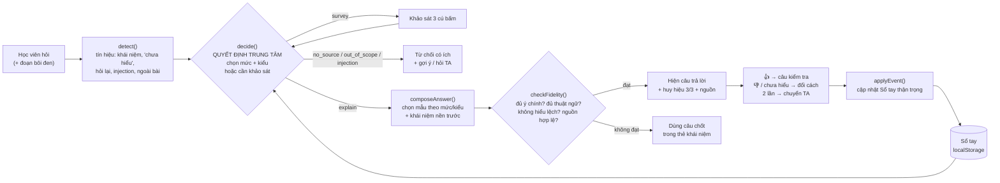

# Codebase · Trợ giảng AI giải thích lại đúng mức (P3)

Phần kỹ thuật của dự án. Giới thiệu chung, cài đặt và **quy định dữ liệu** ở [README gốc](../README.md).

> **Pain P3:** học viên đã đọc giải thích của tutor mà vẫn chưa hiểu; tutor không biết họ vướng ở đâu nên giảng lại cùng một kiểu → hỏi đi hỏi lại. Case gốc: **T10728** (phần Attention, Day 1).

Ba phần chạy độc lập được:

| Thư mục | Là gì | Chạy thế nào |
|---|---|---|
| `frontend/` | Giao diện trang học VLearn + khung Trợ giảng AI | Bấm đúp `frontend/index.html` (logic bằng luật) hoặc mở qua backend để dùng AI thật |
| `backend/` | API + agent: chẩn đoán mức → viết giải thích → chấm độ bám bài giảng | `uvicorn app.main:app --port 8000` → mở `http://localhost:8000/` |
| `eval/` | 35 case golden set, script chấm, rubric, lưới độ phủ, báo cáo từng vòng | `python eval/run_eval.py --round N --split test` |

## 1. Chạy thử

### Windows (PowerShell)

Mở PowerShell tại thư mục gốc repository:

```powershell
# (1) Tuỳ chọn: sinh dữ liệu cục bộ từ data pack — không commit
python scripts/build_local_data.py
# hoặc: python scripts/build_local_data.py --pack "<đường dẫn>\data\vlearn-pack"

# (2) Mock + backend (AI thật hoặc FakeLLM)
cd backend
py -3 -m venv .venv
.\.venv\Scripts\python.exe -m pip install -r requirements.txt
Copy-Item .env.example .env
# Mở .env rồi chọn LLM_PROVIDER=fake | openai | claude | gemini
.\.venv\Scripts\python.exe -m uvicorn app.main:app --port 8000
# Mở http://localhost:8000/

# (3) Test, mở PowerShell mới rồi chạy từ thư mục gốc repository
cd ..\..
node --test frontend/tests/engine.test.js
backend\.venv\Scripts\python.exe -m pytest -q backend

# (4) Đánh giá golden set
backend\.venv\Scripts\python.exe eval\run_eval.py --round 1 --split test
backend\.venv\Scripts\python.exe eval\run_eval.py --round 1 --split test --baseline
```

Yêu cầu Windows: cài Python 3.11+, Node.js và bật tuỳ chọn **Add Python to PATH** khi cài Python. Nếu lệnh `py` không có, thay `py -3` bằng `python`.

`scripts/check_no_data.sh` là script Bash. Trên Windows, chạy bằng Git Bash hoặc WSL:

```bash
bash scripts/check_no_data.sh
```

### Linux / macOS

```bash
# (1) Tuỳ chọn: sinh dữ liệu cục bộ từ data pack (nguyên văn đoạn nguồn, ứng viên golden set) — không commit
python scripts/build_local_data.py            # hoặc --pack "<đường dẫn>/data/vlearn-pack"

# (2a) Chỉ mock: bấm đúp frontend/index.html

# (2b) Mock + backend (AI thật hoặc FakeLLM)
cd backend
python3 -m venv .venv && .venv/bin/pip install -r requirements.txt
cp .env.example .env                                     # LLM_PROVIDER=fake | openai | claude | gemini
.venv/bin/uvicorn app.main:app --port 8000               # mở http://localhost:8000/

# (3) Test
node --test frontend/tests/engine.test.js                # 16 test logic của mock
backend/.venv/bin/python -m pytest -q backend   # 40 test backend (FakeLLM)

# (4) Đánh giá golden set
backend/.venv/bin/python eval/run_eval.py --round 1 --split test
backend/.venv/bin/python eval/run_eval.py --round 1 --split test --baseline
```

Không chạy bước (1) thì mọi thứ vẫn chạy: nút "Xem đoạn gốc" hiện **tóm tắt**, backend dùng chế độ tóm tắt để tìm nguồn.

**Cách demo:** bấm **Kịch bản demo** (góc trái dưới) → chọn KB1–KB6. Ở chế độ live, bảng demo có thêm 2 hồ sơ minh hoạ bộ nhớ dài hạn ("Lâu ngày không học", "Từng hiểu nhờ ví dụ thư viện"). Có thể bôi đen một đoạn trong bài rồi bấm **Hỏi Trợ giảng AI**. Bật **Chế độ giám khảo** trong bảng demo để hiện JSON quyết định (mức 1–5) dưới mỗi câu trả lời; học viên bình thường không thấy tên mức.

| KB | Hồ sơ giả | Thể hiện |
|---|---|---|
| 1 | Đã vững | Trả lời thẳng ở mức 4 (Kỹ thuật), không khảo sát; bấm **Sâu hơn** lên mức 5 |
| 2 | Trung bình | Trả lời → **Mình chưa hiểu** → khảo sát (điền sẵn) → giải thích lại 4 phần → câu kiểm tra → Sổ tay cập nhật thận trọng |
| 3 | Người mới | Câu kiểu T10728 → mức 1: giải thích **vector** trước → nhãn "ngoài bài" cho phép cộng có trọng số |
| 4 | Chưa có hồ sơ | Câu mơ hồ → khảo sát → **Bỏ qua** → mức 2, ngắn gọn |
| 5 | bất kỳ | "ReAct là gì?" → không có nguồn → không bịa, soạn câu hỏi cho TA |
| 6 | bất kỳ | Injection / viết blog → từ chối ngắn, gợi ý câu hỏi đúng phạm vi |
| 7 | bất kỳ | Chọn sai câu kiểm tra 2 lần → chuyển TA |

---

## 2. Cây thư mục

```text
K4-3B-E403-THE-LIEMS/
├── README.md                         # Thông tin nhóm (theo mẫu của đề)
├── spec.md                           # AI Spec (nộp CP4)
├── A2-painpoint-khao-sat.md          # Pain point từ data + bộ câu hỏi khảo sát
├── .gitignore                        # Chặn *.local.*, data/, *.csv, *.db, *.jsonl, .env, .venv
└── 
    ├── README.md                     # File này
    ├── mock/                         # ── Giao diện (HTML/CSS/JS thuần) ──
    │   ├── index.html                # Trang học VLearn + panel Trợ giảng AI + Sổ tay + bảng demo
    │   ├── css/styles.css
    │   ├── js/
    │   │   ├── content.js            # Dữ liệu soạn sẵn cho chế độ mock
    │   │   ├── engine.js             # Logic luật (chế độ mock; test bằng Node)
    │   │   ├── api.js                # Gọi backend khi mở với ?mode=live
    │   │   └── app.js                # UI; mỗi thao tác có nhánh mock và nhánh live
    │   └── data/sources.local.js     # ⛔ nguyên văn đoạn nguồn cho mock (sinh bởi script)
    ├── backend/                      # ── API + agent (Python/FastAPI) — xem backend/README.md ──
    │   ├── app/                      # orchestrator, policy, retrieval, fidelity, profile_store, llm/, prompts/…
    │   ├── cards/                    # Thẻ khái niệm YAML (đã duyệt) + sổ đăng ký nguồn
    │   ├── personas.yaml             # Hồ sơ giả
    │   ├── tests/                    # 40 test pytest
    │   └── requirements.txt · .env.example
    ├── eval/
    │   ├── golden_set.csv            # 35 case (12 dev · 23 test), 11 case lấy từ chatlog thật
    │   ├── coverage.md               # Lưới đầu vào: 4 chiều × các giá trị, ô trống = lỗ hổng
    │   ├── run_eval.py               # Chạy golden set / baseline → bảng %
    │   ├── rubric.md                 # Cách gán nhãn, chấm D1–D6
    │   ├── changelog.md              # Nhật ký các vòng
    │   ├── results/roundN-*.md       # Bảng kết quả (commit) · *.local.jsonl chi tiết (⛔)
    │   ├── traces-sample/*.json      # Prompt + phản hồi thô của vài lượt, đã che nguyên văn (commit)
    │   └── golden_candidates.local.csv  # ⛔ 102 lượt chatlog K4 ứng viên
    ├── scripts/
    │   ├── build_local_data.py       # Data pack → *.local.* (⛔ không commit)
    │   ├── build_index.py            # Kiểm tra chỉ mục BM25, gợi ý ngưỡng
    │   ├── draft_cards.py            # LLM soạn NHÁP thẻ khái niệm → người duyệt
    │   └── check_no_data.sh          # Chặn commit dữ liệu / key
    ├── tests/engine.test.js          # 16 test logic mock
    └── data/chunks.local.json        # ⛔ 260 đoạn transcript-04/06
```

**Quy tắc dữ liệu:** mọi thứ lấy từ data pack chỉ nằm trong file `*.local.*` hoặc thư mục `data/` — đều bị `.gitignore` chặn. Trong repo chỉ có **mã đoạn** (`T06-130`, `T10728`) và diễn giải nhóm tự viết. Trước khi commit, chạy `bash scripts/check_no_data.sh` và `git status --ignored`.

---

## 3. Kiến trúc kỹ thuật

### 3.1 Luồng một câu hỏi



### 3.2 Các module

| Module | Vai trò | Ghi chú |
|---|---|---|
| `detect(text, selection, session)` | Chuẩn hoá tiếng Việt (bỏ dấu) rồi dò tín hiệu bằng regex | Không phải quyết định AI; chỉ là đầu vào |
| `decide(intent, state)` | **Quyết định trung tâm duy nhất.** Trả JSON `level`, `style`, `missing_concepts`, `confidence`, `need_survey`, `reason_for_user`, `source_ids`, `in_scope` | Mock: luật; CP3: **LLM gọi lần 1** trả đúng JSON này |
| `composeAnswer(decision)` | Lấy mẫu câu trả lời theo mức/kiểu, chèn khái niệm nền, thêm đoạn "ngoài bài" khi cần | Mock: mẫu soạn sẵn; CP3: **LLM gọi lần 2** sinh theo cấu trúc 4 phần |
| `checkFidelity(concept, blocks)` | Validator độ bám bài giảng: phủ `core_claims`, đủ `requiredTerms`, không có `misconceptions`, block nào cũng có nguồn hoặc nhãn "ngoài bài" | **Giữ nguyên ở CP3** (thêm LLM-judge cho phần phủ ý) |
| `applyEvent(profile, event)` | Tự khai → ghi ngay · chưa hiểu → hạ ngay · đúng 2 lần liên tiếp → nâng 1 bậc · sai → mất chuỗi · xoá | Mọi thay đổi kèm **Hoàn tác** |
| `pickCheck` / `gradeCheck` | Câu kiểm tra có đáp án nhiễu = hiểu lệch phổ biến; trả về lời sửa + nguồn | |

### 3.3 Thang giải thích 5 mức (nội bộ)

| Mức | Tên (chỉ trong JSON) | Cách giải thích | Khi nào chọn |
|---|---|---|---|
| L1 | Làm quen | Câu rất ngắn, "3 từ cần nhớ", ví dụ con mèo, khái niệm nền trước | Có khái niệm nền đang "Chưa" |
| L2 | Cơ bản | 4 phần: ví dụ → bảng nối → câu chốt → giới hạn ví dụ | Khái niệm chính "Chưa", hoặc bỏ qua khảo sát |
| L3 | Hiểu bản chất | Ý chính + bảng nối + câu chốt, không cần ví dụ | Chưa có hồ sơ, hoặc "Biết sơ" |
| L4 | Kỹ thuật | Các bước tính Q·K → softmax → trọng số → Value | "Biết sơ" + nền "Hiểu rõ", hoặc "Hiểu rõ" |
| L5 | Chuyên sâu | Công thức, song song vs RNN, hệ quả ngữ cảnh dài, lab bertviz | "Hiểu rõ" + nền "Hiểu rõ" |

Học viên nói chưa hiểu (lần đầu, có hồ sơ) → hạ 1 bậc. Nút **Dễ hiểu hơn / Sâu hơn** dịch 1 bậc. Sổ tay vẫn giữ 3 mức tự khai (Chưa / Biết sơ / Hiểu rõ) cho dễ trả lời.

### 3.3b Mức confidence (mock)

`confidence = 0.35 + 0.55 × (số khái niệm đã có trong Sổ tay / (1 + số khái niệm nền))`. Tắt ghi nhớ → 0.35. Dưới 0.6 mà học viên nói chưa hiểu → hiện khảo sát.

### 3.4 Thẻ khái niệm (chống lệch kiến thức khi đơn giản hoá)

Mỗi khái niệm trong `content.js → CONCEPTS` có: `claims` (ý chính + mã đoạn), `prerequisites`, `requiredTerms`, `misconceptions` (cụm cấm + lời sửa + nguồn). Câu trả lời mức cơ bản luôn có 4 phần: **ví dụ đời thường → bảng nối ví dụ với thuật ngữ → câu chốt bằng thuật ngữ gốc → "ví dụ này đơn giản hoá ở chỗ…"**. Thẻ khái niệm được TA/giảng viên duyệt một lần (Augment); lúc chạy AI chỉ giải thích trong phạm vi thẻ (Conditional).

### 3.5 Phần giả lập và phần thật

| Thành phần | Mock (mở file) | Live (backend) |
|---|---|---|
| Giao diện, luồng, khảo sát, Sổ tay, chuyển TA | Thật | Thật (dữ liệu từ API) |
| Nhận diện tín hiệu | Regex (`engine.js`) | Regex (`signals.py`, `guard.py`) |
| Tìm đoạn nguồn | Gán sẵn mã đoạn | **BM25** trên 260 đoạn, chỉ tính là có căn cứ khi đoạn thuộc thẻ khái niệm |
| Quyết định mức/kiểu | Luật | **LLM #1** (JSON cố định) → luật cứng ép lại (`policy.enforce`) |
| Viết giải thích | Mẫu soạn sẵn | **LLM #2**, đầu vào: thẻ + đoạn nguồn + mẫu tham khảo đúng mức |
| Kiểm tra độ bám bài giảng | Luật | Luật + **LLM #3** chấm; rớt → viết lại 1 lần → dùng mẫu đã duyệt |
| Hồ sơ, bộ nhớ dài hạn | localStorage | SQLite: mức hiểu, cách giải thích hiệu quả/không, quên dần 14 ngày, hoàn tác |
| Chuyển TA | Soạn câu hỏi, sao chép | Như mock; không tự gửi |

Lỗi mạng/API ở chế độ live → trang báo và tạm dùng engine của mock cho lượt đó.

### 3.6 Nguyên tắc HAX/PAIR — vị trí trong mock

| Nguyên tắc | Vị trí |
|---|---|
| **G10** Thu hẹp phạm vi khi nghi ngờ | Thẻ khảo sát chỉ hiện khi confidence thấp / chưa hiểu sau khi đã giải thích; màn "chưa có trong bài" |
| **G8** Gạt bỏ dễ dàng | Nút **Bỏ qua, giải thích luôn** (khảo sát) và **Bỏ qua** (câu kiểm tra) |
| **G9** Sửa dễ dàng | Nút **Dễ hiểu hơn / Ví dụ khác / Ngắn hơn / Sâu hơn** (dịch 1 bậc trên thang 5 mức, không lộ tên mức); **Hoàn tác** khi Sổ tay đổi |
| **G11** Giải thích vì sao | Dòng tím nói lý do bằng lời thường ("Sổ tay ghi bạn chưa rõ Vector nên mình nói phần này trước"); bảng nối ví dụ → thuật ngữ; mã nguồn cạnh từng đoạn |
| **G2** Làm rõ làm tốt đến đâu | Huy hiệu "Giữ đủ 3/3 ý chính"; nhãn "Ngoài bài giảng"; dòng "Trợ giảng AI có thể sai" |
| **G13/G14** Học từ hành vi, thay đổi thận trọng | `applyEvent()` + thông báo "đúng thêm 1 lần nữa mình mới nâng" |
| **G15** Mời phản hồi chi tiết | 👎 → "Khó hiểu / Quá dài / Có vẻ sai kiến thức" |
| **G17** Quyền kiểm soát tổng | Sổ tay học tập: bật/tắt ghi nhớ, sửa, xoá từng dòng, xoá hết |

---

## 4. Giới hạn đã biết

- Chỉ có nội dung cho **Self-attention** (và phần nền: token, vector, similarity score, multi-head) của Day 1.
- Tín hiệu hiểu câu hỏi dùng regex nên câu diễn đạt lạ có thể rơi vào nhánh "gợi ý câu hỏi".
- `eval/results/round0-all.md` là kết quả chạy bằng **FakeLLM** (kiểm tra đường ống), không phải kết quả AI.
- Khi đọc báo cáo, xem cột **Dự phòng** trước cột %: `template:validator` nghĩa là câu trả lời của AI bị loại và hệ thống dùng mẫu đã duyệt.
- Danh sách `outside_terms` trong `cards/_sources.yaml` phải lớn dần: thấy học viên hỏi thuật ngữ chưa có thẻ thì thêm vào, nếu không trợ giảng dễ trả lời nhầm sang khái niệm gần nhất.
- Nhãn trong `golden_set.csv` là **nháp** — cần 2 người gán lại theo `eval/rubric.md`.
- Ba adapter OpenAI / Claude / Gemini đã viết theo SDK và kiểm tra khớp schema, nhưng **chưa gọi thử với key thật**. Việc đầu tiên khi có key: `LLM_PROVIDER=openai` rồi chạy `run_eval.py --split dev`.
- "Lịch sử chat", "Gửi yêu cầu", "Mở kênh Discord" là nút giả (hiện thông báo).
- Font Be Vietnam Pro tải từ Google Fonts; offline thì dùng font hệ thống.
